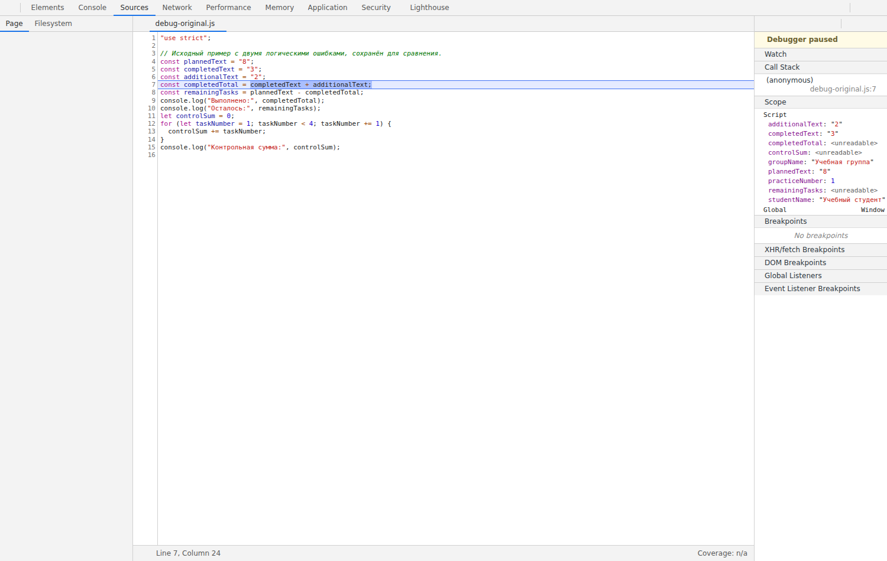

# Отчёт по практической работе № 1

**Тема:** подготовка окружения и первые программы на JavaScript.

**Автор:** реквизит не опубликован  
**Группа:** реквизит не опубликован  
**Вариант:** 7  
**Дата проверки:** 04.10.2026.

Проверено в отдельном окружении разработки: Ubuntu 24.04.3 LTS, Node.js v24.19.0, npm 11.9.0, Git 2.51.1, Chromium 138.0.7204.0. Это фактическое окружение проверки, а не описание личного компьютера автора.

## Запуск

Команды выполняются из корня репозитория:

```bash
node practice-01/js/hello.js
node practice-01/js/types.js
node practice-01/js/progress.js
node practice-01/js/plan.js
node practice-01/js/debug.js
```

Браузер: открыть `practice-01/index.html`, затем Console в инструментах разработчика. Для другой задачи заменить путь `script` на нужный файл, обновить страницу и посмотреть Console. Перед сдачей в HTML оставлен `./js/hello.js`. Формы и консольный ввод не требуются.

## Задание 1. Две среды выполнения

Один файл `hello.js` запущен в Node.js и Chromium. Имя, группа и номер работы совпали. В терминале последняя строка — `Тип document: undefined`, в Console браузера — `Тип document: object`. Браузер предоставляет объект документа, Node.js — нет. Вывод появляется в Console, а не в тексте HTML-страницы.

Фактические протоколы: [Node.js](./results/node-output.txt), [браузер](./results/browser-output.txt). Все пять обязательных файлов выполнены в обеих средах.

## Задание 2. Типы и преобразования

Ожидания определены по правилам языка до проверочного запуска. Фактические значения получены выполнением `types.js`.

| Выражение | Ожидание | Фактическое значение | Тип результата | Объяснение |
| --- | --- | --- | --- | --- |
| `"8" + 2` | `"82"` | `"82"` | `string` | Оператор + соединяет строку и число как текст. |
| `"8" - 2` | `6` | `6` | `number` | Вычитание преобразует строку в число. |
| `Number("8") + 2` | `10` | `10` | `number` | Преобразование выполнено до сложения. |
| `"12" > "3"` | `false` | `false` | `boolean` | Две строки сравниваются лексикографически; «1» раньше «3». |
| `12 === "12"` | `false` | `false` | `boolean` | Типы различаются, преобразования при === нет. |
| `Number("")` | `0` | `0` | `number` | Пустая строка преобразуется в ноль; это ещё не проверка ввода. |
| `Number("text")` | `NaN` | `NaN` | `number` | Текст не представляется числом; тип NaN остаётся number. |
| `Boolean("false")` | `true` | `true` | `boolean` | Любая непустая строка даёт true, независимо от текста. |
| `typeof null` | `"object"` | `"object"` | `string` | Исторический результат typeof null. Сам результат typeof — строка. |
| `typeof NaN` | `"number"` | `"number"` | `string` | NaN относится к типу number; результат оператора — строка. |

## Задание 3. Сводка

Проверка целочисленности предшествует проверке границ. Затем отдельно обрабатывается пустой список. Процент считается по исходным количествам, округляется только для отображения.

| Вход: всего / выполнено | Ожидание | Фактический вывод | Итог |
| --- | --- | --- | --- |
| 12, 5 | Осталось: 7; Прогресс: 41.7%; Статус: В работе | Всего задач: 12; Выполнено: 5; Осталось: 7; Прогресс: 41.7%; Статус: В работе | Пройдено |
| 0, 0 | Задач пока нет | Задач пока нет | Пройдено |
| 5, 0 | Осталось: 5; Прогресс: 0.0%; Статус: Не начато | Всего задач: 5; Выполнено: 0; Осталось: 5; Прогресс: 0.0%; Статус: Не начато | Пройдено |
| 5, 5 | Осталось: 0; Прогресс: 100.0%; Статус: Завершено | Всего задач: 5; Выполнено: 5; Осталось: 0; Прогресс: 100.0%; Статус: Завершено | Пройдено |
| 5, 6 | Ошибка: | Ошибка: выполненное количество должно быть от 0 до общего. | Пройдено |
| -1, 0 | Ошибка: | Ошибка: общее количество должно быть от 0 до 1000. | Пройдено |
| 5, 2.5 | Ошибка: | Ошибка: количество задач должно быть целым числом. | Пройдено |
| "5", 2 | Ошибка: | Ошибка: количество задач должно быть целым числом. | Пройдено |
| 1001, 0 | Ошибка: | Ошибка: общее количество должно быть от 0 до 1000. | Пройдено |
| NaN, 0 | Ошибка: | Ошибка: количество задач должно быть целым числом. | Пройдено |
| 10, 7 | Осталось: 3; Прогресс: 70.0%; Статус: В работе | Всего задач: 10; Выполнено: 7; Осталось: 3; Прогресс: 70.0%; Статус: В работе | Пройдено |

Основной набор варианта 7: 10 всего, 7 выполнено, 3 осталось, 70.0%, «В работе». Он оставлен в исходном файле.

## Задание 4. План по дням

Используется `while`. На каждом шаге выполняется `Math.min(dailyLimit, remainingTasks)`, поэтому остаток не становится отрицательным. Положительный лимит проверяется до цикла, включая случай нулевого остатка.

| Вход: всего / выполнено / лимит | Ожидание | Фактический вывод | Итог |
| --- | --- | --- | --- |
| 12, 5, 3 | День 3: выполнено 1, осталось 0; Потребуется дней: 3 | Осталось задач: 7; День 1: выполнено 3, осталось 4; День 2: выполнено 3, осталось 1; День 3: выполнено 1, осталось 0; Потребуется дней: 3 | Пройдено |
| 10, 4, 3 | День 2: выполнено 3, осталось 0; Потребуется дней: 2 | Осталось задач: 6; День 1: выполнено 3, осталось 3; День 2: выполнено 3, осталось 0; Потребуется дней: 2 | Пройдено |
| 5, 3, 10 | День 1: выполнено 2, осталось 0; Потребуется дней: 1 | Осталось задач: 2; День 1: выполнено 2, осталось 0; Потребуется дней: 1 | Пройдено |
| 5, 5, 2 | Потребуется дней: 0 | Все задачи уже выполнены; Потребуется дней: 0 | Пройдено |
| 0, 0, 2 | Потребуется дней: 0 | Все задачи уже выполнены; Потребуется дней: 0 | Пройдено |
| 5, 2, 0 | Ошибка: | Ошибка: дневная норма должна быть целым числом от 1 до 1000. | Пройдено |
| 5, 2, 1.5 | Ошибка: | Ошибка: дневная норма должна быть целым числом от 1 до 1000. | Пройдено |
| 5, 6, 2 | Ошибка: | Ошибка: выполненное количество должно быть от 0 до общего. | Пройдено |
| 5, 2, "2" | Ошибка: | Ошибка: дневная норма должна быть целым числом от 1 до 1000. | Пройдено |
| 5, 2, 1001 | Ошибка: | Ошибка: дневная норма должна быть целым числом от 1 до 1000. | Пройдено |
| 10, 7, 3 | День 1: выполнено 3, осталось 0; Потребуется дней: 1 | Осталось задач: 3; День 1: выполнено 3, осталось 0; Потребуется дней: 1 | Пройдено |
| 5, 5, 0 | Ошибка: | Ошибка: дневная норма должна быть целым числом от 1 до 1000. | Пройдено |

В варианте 7 нужен один день: выполнено 3, осталось 0. В общем примере 12 / 5 / 3 нужны три дня: 3, 3 и 1 задача.

Получено 23 успешных расчётных сценария, включая дополнительную проверку недопустимого лимита при выполненном списке. [Полный фактический протокол](./results/checks.txt).

## Задание 5. Отладка

Исходная программа сохранена в `js/debug-original.js`, исправленная — в `js/debug.js`. Исходный вывод: «Выполнено: 32», «Осталось: -24», «Контрольная сумма: 6». После исправления: 5, 3 и 10.

| Ошибка | Наблюдение | Причина | Исправление | Результат |
| --- | --- | --- | --- | --- |
| Сложение количества | Выполнено 32, остаток −24 | "3" + "2" соединяет строки | Number перед сложением | Выполнено 5, осталось 3 |
| Граница цикла | Сумма 1 + 2 + 3 = 6 | Условие < 4 исключает число 4 | Условие <= 4 | Сумма 10 |

[Протокол остановок и шага отладчика](./results/debugger.txt). На остановке перед сложением `completedText` и `additionalText` имеют значения «3» и «2» и тип string. После шага `completedTotal` — «32», тип string. На остановках внутри цикла перед прибавлением наблюдались пары taskNumber / controlSum: 1 / 0, 2 / 1, 3 / 3. Затем число 4 не прошло условие < 4, и сумма осталась 6.



Для повторения открыть `debug-original.js` в Sources, поставить точку перед `completedTotal`, обновить страницу и выполнить Step over. Затем проверить границу цикла. В обязательном `debug.js` оставлена исправленная версия.

## Дополнительное задание

Не выполнялось. Выполнена обязательная часть.

## Вывод

Подготовлены и проверены программы с типами, преобразованиями, условиями и циклом. Проверка входа предотвращает неверные расчёты и бесконечный цикл. Наиболее показательная ошибка — сложение строк: программа запускалась без исключения, но давала неправильный результат.

[Разбор кода и контрольные вопросы](../docs/DEFENSE.md).
