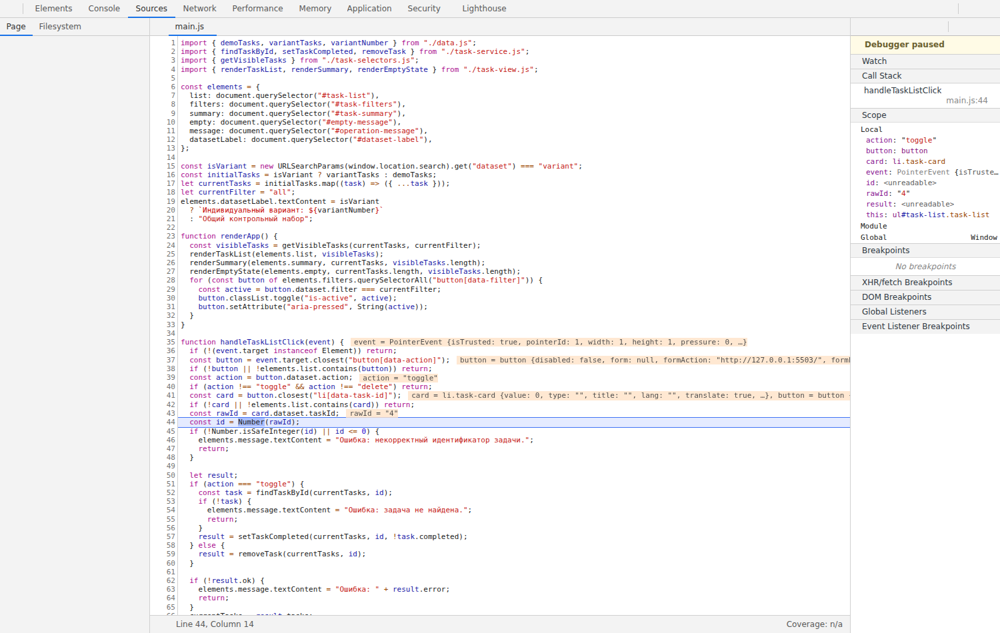
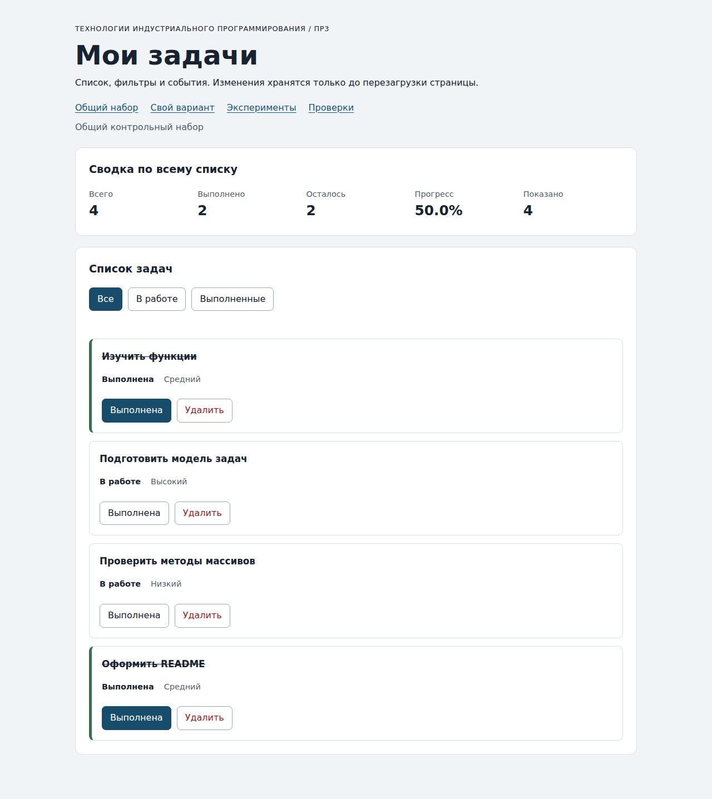
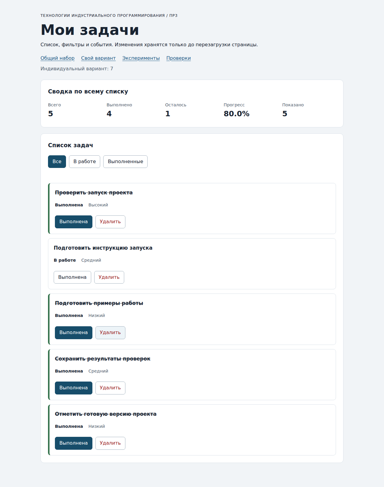

# Отчёт по практической работе № 3

**Тема:** работа с DOM и событиями.

**Автор:** реквизит не опубликован  
**Группа:** реквизит не опубликован  
**Вариант:** 7  
**Дата проверки:** 04.10.2026.

Проверено в отдельном окружении разработки: Ubuntu 24.04.3 LTS, Node.js v24.19.0, npm 11.9.0, Git 2.51.1, Chromium 138.0.7204.0. Это фактическое окружение проверки, а не описание личного компьютера автора.

## Запуск

Рабочая папка — `practice-03`:

```bash
npm run check:service
npm start
```

Без npm, из корня репозитория:

```bash
node practice-03/checks/service.checks.js
node practice-03/tools/serve.mjs
```

- Приложение: <http://127.0.0.1:5503/>.
- Вариант: <http://127.0.0.1:5503/index.html?dataset=variant>.
- Эксперименты: <http://127.0.0.1:5503/examples/dom-events.html>.
- Проверки: <http://127.0.0.1:5503/checks.html>.

Остановка — `Ctrl+C`. Зависимостей нет. HTML с ES-модулями открывается через HTTP, а не `file://`. При занятом порте: `node tools/serve.mjs 5505`, затем использовать порт 5505 в адресах.

## Перенос ПР2 и организация кода

`task-service.js` и `data.js` скопированы из выполненной ПР2 без изменений. Модуль сервиса повторно прошёл 35 проверок. Все локальные зависимости находятся внутри ПР3, поэтому соседняя папка ПР2 для запуска не нужна.

| Модуль | Ответственность |
| --- | --- |
| data.js | Общий и индивидуальный исходные наборы |
| task-service.js | Чтение, сводка и неизменяющие вход операции |
| task-selectors.js | Выборка для текущего фильтра |
| task-view.js | Создание карточек, список, сводка и пустые сообщения |
| main.js | Полный currentTasks, currentFilter, обработчики и renderApp |

Подписки установлены один раз контейнерам. При рендере меняются только дочерние карточки. Для названий и сообщений используется `textContent`.

## Пять экспериментов

| № | Прогноз до запуска | Фактический результат | Объяснение |
| --- | --- | --- | --- |
| 1 | null и NodeList длиной 0 | null; 0 | querySelector возвращает null, querySelectorAll — коллекцию |
| 2 | "23" / string; после Number — 23 / number | "23" / string; числовое значение 23 | dataset хранит строки |
| 3 | Старый NodeList — 1; новый запрос после двух добавлений — 3 | Старый — 1; новые запросы — 2, затем 3 | querySelectorAll даёт статическую коллекцию |
| 4 | Текст с <strong>, без элемента strong | Полная строка; strong внутри заголовка отсутствует | textContent не разбирает HTML |
| 5 | Захват контейнера → кнопка при всплытии → контейнер при всплытии | phase=1 / lab-card; phase=3 / lab-button; phase=3 / lab-card. target=lab-label | Непосредственная цель — вложенный span; currentTarget меняется |

Действия выполнены в настоящем Chromium. В обработчике экспериментальной кнопки дополнительно проверена остановка: target = lab-label, currentTarget = lab-button, eventPhase = 3. [Фактический журнал](./results/experiments.txt).

## Общий сценарий

В столбце «Ожидание» — контрольные значения методички; в соседних столбцах — прочитанное состояние DOM после запуска.

| Шаг | Ожидание: id; всего / выполнено / осталось / % / показано | Фактические id | Фактическая сводка | Сообщение | Итог |
| --- | --- | --- | --- | --- | --- |
| 0. Исходное состояние | [1, 4, 7, 10]; 4 / 2 / 2 / 50.0% / 4 | [1, 4, 7, 10] | 4 / 2 / 2 / 50.0% / 4 | — | Пройдено |
| 1. В работе | [4, 7]; 4 / 2 / 2 / 50.0% / 2 | [4, 7] | 4 / 2 / 2 / 50.0% / 2 | — | Пройдено |
| 2. Выполнить 4 | [7]; 4 / 3 / 1 / 75.0% / 1 | [7] | 4 / 3 / 1 / 75.0% / 1 | — | Пройдено |
| 3. Все | [1, 4, 7, 10]; 4 / 3 / 1 / 75.0% / 4 | [1, 4, 7, 10] | 4 / 3 / 1 / 75.0% / 4 | — | Пройдено |
| 4. Удалить 7 | [1, 4, 10]; 3 / 3 / 0 / 100.0% / 3 | [1, 4, 10] | 3 / 3 / 0 / 100.0% / 3 | — | Пройдено |
| 5. Пустой фильтр | []; 3 / 3 / 0 / 100.0% / 0 | [] | 3 / 3 / 0 / 100.0% / 0 | Нет задач по выбранному фильтру. | Пройдено |
| 6. Переключить 1 | [1, 4, 10]; 3 / 2 / 1 / 66.7% / 3 | [1, 4, 10] | 3 / 2 / 1 / 66.7% / 3 | — | Пройдено |
| 7. Удалить все | []; 0 / 0 / 0 / 0.0% / 0 | [] | 0 / 0 / 0 / 0.0% / 0 | Список задач пуст. | Пройдено |
| 8. Перезагрузка | [1, 4, 7, 10]; 4 / 2 / 2 / 50.0% / 4 | [1, 4, 7, 10] | 4 / 2 / 2 / 50.0% / 4 | — | Пройдено |

Перезагрузка вернула исходные четыре задачи. Отсутствие сохранения в этой работе ожидаемо.

## Индивидуальный вариант

Тема и шесть исходных задач сохранены из ПР2. Выполнены просмотр всех трёх фильтров, переключение статуса 23, удаление 37 и повторная проверка фильтров.

| Этап | Ожидание: всего / выполнено / осталось / % / показано | Фактическая сводка | Фактические id | Итог |
| --- | --- | --- | --- | --- |
| Исходный вариант | 6 / 6 / 0 / 100.0% / 6 | 6 / 6 / 0 / 100.0% / 6 | [11, 23, 37, 41, 58, 64] | Пройдено |
| Исходный фильтр В работе | 6 / 6 / 0 / 100.0% / 0 | 6 / 6 / 0 / 100.0% / 0 | [] | Пройдено |
| Исходный фильтр Выполненные | 6 / 6 / 0 / 100.0% / 6 | 6 / 6 / 0 / 100.0% / 6 | [11, 23, 37, 41, 58, 64] | Пройдено |
| Переключить 23 | 6 / 5 / 1 / 83.3% / 6 | 6 / 5 / 1 / 83.3% / 6 | [11, 23, 37, 41, 58, 64] | Пройдено |
| Удалить 37 | 5 / 4 / 1 / 80.0% / 5 | 5 / 4 / 1 / 80.0% / 5 | [11, 23, 41, 58, 64] | Пройдено |
| Итог В работе | 5 / 4 / 1 / 80.0% / 1 | 5 / 4 / 1 / 80.0% / 1 | [23] | Пройдено |
| Итог Выполненные | 5 / 4 / 1 / 80.0% / 4 | 5 / 4 / 1 / 80.0% / 4 | [11, 41, 58, 64] | Пройдено |

Итоговые id `[11, 23, 41, 58, 64]`, всего 5, выполнено 4, осталось 1, прогресс 80.0%. Экспортированный исходный набор сохранил шесть выполненных задач.

## Автоматизированные проверки

- Сервис: **35 пройдено, 0 ошибок**. [Полный вывод](./results/service-checks.txt).
- Браузер: **36 пройдено, 0 ошибок**. [Полный вывод](./results/browser-checks.txt).

Оба набора преподавателя оставлены без изменений. Они дополняются сценарием варианта, проверкой клавиатуры и собственными случаями.

## Собственные проверки

| Сценарий | Ожидание | Фактический результат | Итог |
| --- | --- | --- | --- |
| Удалить 1, 4, 7; проверить фильтр оставшейся выполненной 10; удалить 10 | Фильтр пуст при total=1; после удаления total=0, другой текст сообщения. | Фильтр пуст при total=1; после удаления total=0, другой текст сообщения. | Пройдено |
| Пять циклов фильтров и четыре переключения одной задачи | 4 / 2 / 2 / 50.0%, четыре карточки, нет двойных обработчиков. | 4 / 2 / 2 / 50.0%, четыре карточки, нет двойных обработчиков. | Пройдено |
| Исходный variantTasks после пользовательских действий | Шесть исходных id; все completed=true; текущий список 5 / 4 / 1. | Шесть исходных id; все completed=true; текущий список 5 / 4 / 1. | Пройдено |

[Машинный протокол наблюдений](./results/qa.json) содержит состояния каждого этапа и фактические результаты собственных случаев.

## Отладка и клавиатура

Точка останова — перед `const id = Number(rawId)` в `handleTaskListClick`. При нажатии подписи статуса задачи 4: `event.target.tagName = "SPAN"`, `event.currentTarget.id = "task-list"`, `rawId = "4"`, тип string; после преобразования id 4, тип number; действие toggle. Найденная запись имеет completed=false. После сервиса результат ok=true, новый массив содержит completed=true у задачи 4, прежний массив — false.

[Протокол остановок](./results/debugger.txt).



| Изменённый data-task-id | Ожидание | Фактическое сообщение | Данные |
| --- | --- | --- | --- |
| 777 | Ошибка; прежнее состояние | Ошибка: задача не найдена. | 4 / 2 / 2 / 50.0%, сохранены |
| 4abc | Ошибка; прежнее состояние | Ошибка: некорректный идентификатор задачи. | 4 / 2 / 2 / 50.0%, сохранены |

Корректный выбор фильтра очистил ошибку и восстановил карточки из настоящего массива.

Enter на фильтре; Space на статусе; Enter на статусе; Tab к удалению; Space на удалении. Фокус возвращён на кнопку, а при исчезновении карточки — на активный фильтр.

После выполнения задачи в фильтре «В работе» фокус получил активный фильтр. Если карточка осталась, фокус вернулся на её новую кнопку. После удаления — на активный фильтр. Ошибок страницы при прогоне не было.

## Вид приложения

Общий набор:



Вариант 7 после переключения 23 и удаления 37:




## Дополнительное задание

Не выполнялось. Выполнена обязательная часть.

## Вывод

Создан интерфейс списка задач с двумя действиями, фильтрами и общей сводкой. Делегирование обрабатывает клики по вложенным подписям. Фильтрация сохраняет скрытые данные, а рендер согласует карточки и счётчики с текущим массивом. Отдельно проверены ошибки идентификатора, два пустых состояния и клавиатурный фокус.

[Разбор функций и контрольные вопросы](../docs/DEFENSE.md).
